# 架构可维护性审视（2026-06-18）

> 目标：找出可以提高可维护性的 deepening opportunities，让后续技能池、13 幕闯关、Boss、装备、奖励和素材迭代有更好的 locality 与 leverage。

## 词汇约定

本文沿用架构审视中的固定词汇：

- **Module**：有 interface 和 implementation 的代码单元，可以是函数、文件、目录或玩法切片。
- **Interface**：调用方必须知道的一切，包括类型、顺序约束、状态不变量、配置和错误模式。
- **Implementation**：Module 内部实现。
- **Depth**：interface 提供的 leverage。**Deep** Module 用较小 interface 隐藏较多行为；**Shallow** Module 的 interface 几乎等于 implementation。
- **Seam**：Module interface 所在的位置；行为可以在这里被替换或收束。
- **Adapter**：满足某个 seam 的具体实现。
- **Leverage**：调用方从 depth 获得的收益。
- **Locality**：维护者从 depth 获得的收益，变更和 bug 集中在一个地方。

## 依据

读取过的主要文档和源码：

- `docs/ARCHITECTURE.md`
- `docs/game-design/game-overview.md`
- `docs/game-design/run-loop.md`
- `docs/game-design/player-skills.md`
- `docs/game-design/system-status.md`
- `docs/game-design/content-roadmap.md`
- `docs/numeric-system/overview.md`
- `docs/numeric-system/act-and-threat.md`
- `docs/numeric-system/implementation-order.md`
- `src/runtime.ts`
- `src/state.ts`
- `src/entities/player.ts`
- `src/entities/particle.ts`
- `src/entities/boss.ts`
- `src/entities/enemy.ts`
- `src/entities/platform.ts`
- `src/entities/bosses/registry.ts`
- `src/entities/enemies/registry.ts`
- `src/systems/playerSkills.ts`
- `src/systems/progression.ts`
- `src/systems/equipment.ts`
- `src/constants/assets.ts`
- `src/assets.ts`
- `src/types/game-state.ts`

当前源码已经有 `bossKills`、`defeatBoss()`、Boss registry、XP 和装备雏形；部分旧文档仍把这些写成未实现。本文以源码为当前事实，文档只作为目标方向。

## 候选 1：Deepen the player skill catalog

**Recommendation strength**：Strong
**Dependency category**：in-process

**Files**

- `src/constants/assets.ts`
- `src/systems/playerSkills.ts`
- `src/entities/player.ts`
- `src/entities/particle.ts`
- `src/systems/progression.ts`
- `src/types/game-state.ts`
- `docs/game-design/player-skills.md`

**Problem**

普通技能这个概念现在是 shallow 的：展示文案、施放图、特效图、等级成长、解锁规则、施放分支、效果 update/draw、命中和返能散在多个 Module。调用方必须重新拼回“一个技能”这个领域概念，interface 几乎等于散落 implementation。

**Solution**

把技能内容事实和技能生命周期收束到一个更 deep 的 player skill catalog Module。HUD、progression、combat 和 asset loading 都向同一个 seam 询问技能事实；技能施放、特效生命周期和资源约束留在 implementation 内部逐步收束。

**Benefits**

- locality：改一个技能只进一个 Module
- leverage：HUD、升级、战斗共享同一份技能事实
- interface 缩小：调用方不再知道多套配置如何拼接
- tests：可以验证技能可解锁性、等级成长、素材完整性和文案一致性

**Before**

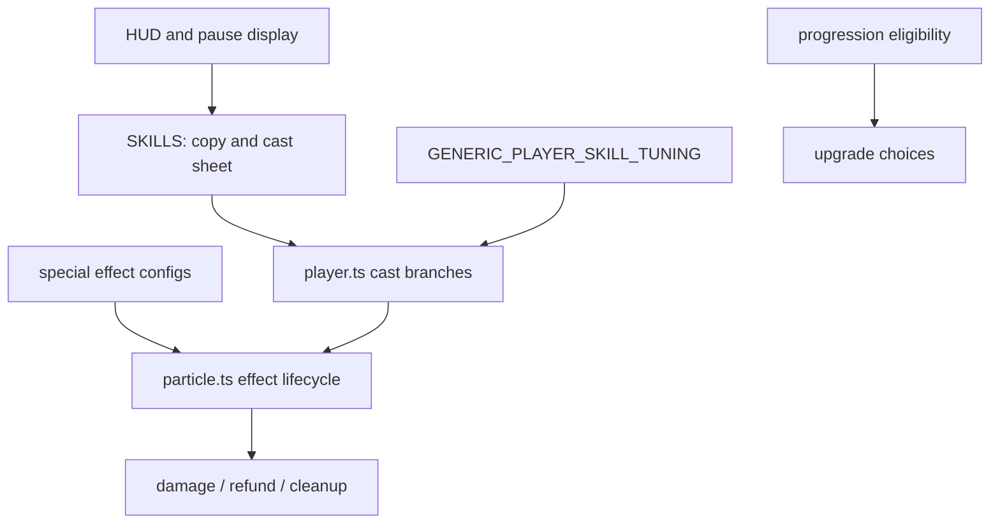

**After**

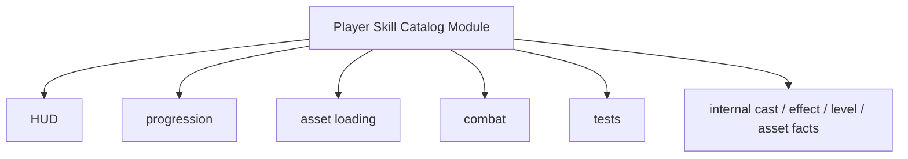

## 候选 2：Deepen combat resolution

**Recommendation strength**：Strong
**Dependency category**：in-process

**Files**

- `src/entities/player.ts`
- `src/entities/particle.ts`
- `src/entities/boss.ts`
- `src/entities/enemies/defeat.ts`
- `src/entities/bosses/defeat.ts`
- `src/systems/equipment.ts`
- `src/systems/progression.ts`

**Problem**

命中处理在玩家普攻、技能 effect、泛用技能 effect、Boss effect 和 projectile 中重复出现：hitbox、cooldown、`damageEnemy()` / `damageBoss()`、VFX、SFX、奖励种类、XP、能量、cover progress、敌人移除、Boss 击败。`resolveEnemyDefeat()` 和 `defeatBoss()` 已经有 depth，但 seam 太晚，调用方仍知道太多前置细节。

**Solution**

把 hit application 和 defeat consequences 收束到更 deep 的 combat resolution Module。各攻击来源只表达“这次命中是什么”，具体伤害、反馈、装备 hook、奖励和击败结算由一个 implementation 负责。

**Benefits**

- locality：奖励、能量、XP 和击败 bug 集中
- leverage：装备 on-hit 逻辑只接一次
- tests：伤害归因、击败只结算一次、Boss 终幕停止重生都能穿过一个 interface
- deletion test：删除这个 Module 会让重复命中逻辑重新散回多个调用方，说明它能赚回 complexity

**Before**

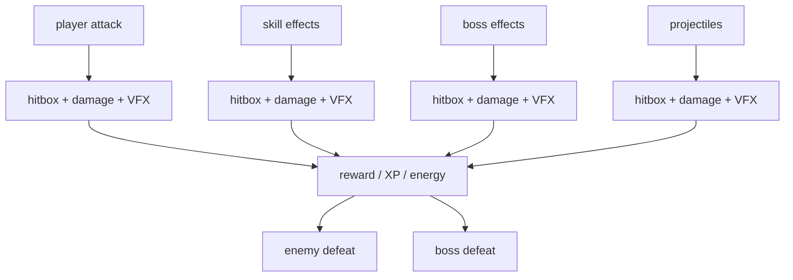

**After**

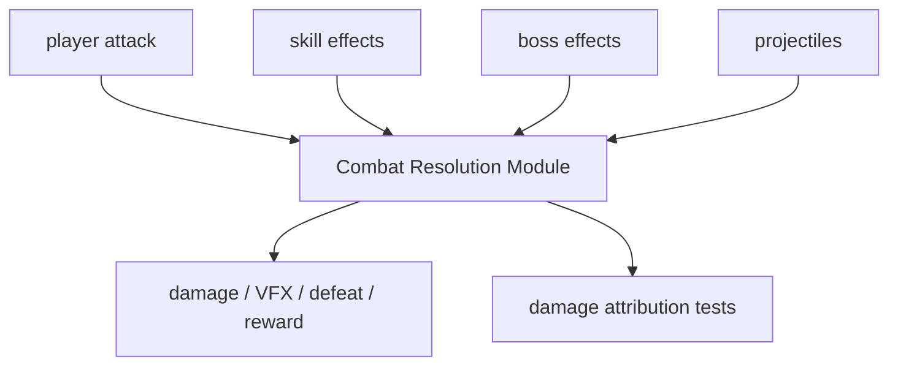

## 候选 3：Create a run progression Module

**Recommendation strength**：Worth exploring
**Dependency category**：in-process

**Files**

- `src/runtime.ts`
- `src/entities/enemy.ts`
- `src/entities/platform.ts`
- `src/entities/boss.ts`
- `src/entities/bosses/defeat.ts`
- `docs/numeric-system/act-and-threat.md`
- `docs/game-design/act-structure.md`

**Problem**

13 幕闯关阶梯已经是目标方向，源码也有 `bossKills` 和 Boss 轮换雏形，但 run progression 仍散在多个 Module：`runtime.ts` 持有 spawn timers，敌人用 `elapsed` 近似解锁，地图用 `elapsed` 推难度，Boss 用 `bossKills` 选 archetype，Boss 击败处理奖励和重生计时。调用方需要知道 `elapsed`、`bossKills`、`act`、`threatScalar` 和本地 timer 的组合规则。

**Solution**

建立一个更 deep 的 run progression Module，集中派生 `act`、`actBand`、`threatScalar`、spawn cadence、Boss schedule 和 reward pacing。实体 Module 保留“生成什么、怎么更新”的 implementation，不再自己解释整局节奏。

**Benefits**

- locality：平衡参数和幕数规则集中
- leverage：敌人、Boss、地图、奖励和 HUD 共享节奏事实
- tests：可以直接断言第 1/6/7/12/13 幕派生结果
- 文档同步：`act-structure.md` 与源码更容易做一致性检查

**Before**

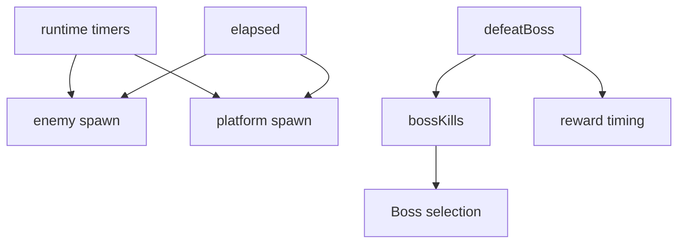

**After**

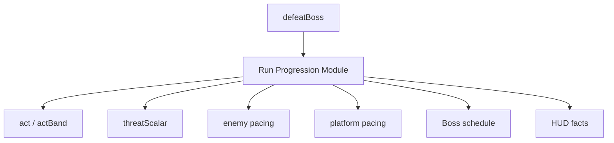

## 候选 4：Deepen Boss encounter archetypes

**Recommendation strength**：Worth exploring
**Dependency category**：in-process

**Files**

- `src/entities/boss.ts`
- `src/entities/bosses/registry.ts`
- `src/types/game-state.ts`
- `src/constants/assets.ts`
- `docs/art/bosses/*.md`

**Problem**

Boss registry 看起来是 archetype seam，但当前 interface 主要装数据；movement、cast selection、pattern spawning、effect update、effect draw 和大量 special cases 仍集中在 `boss.ts` 这个巨大 implementation 中。新增或调整 Boss 要同时理解 registry、union types、effect arrays、runtime update/draw 顺序和 monolithic boss logic。

**Solution**

逐步让每个 Boss archetype Module 拥有自己的 movement、cast、pattern effect 和 draw behavior。顶层 Boss encounter Module 负责“当前 encounter 的生命周期”，而不是实现每个 Boss 的全部行为。

**Benefits**

- locality：一个 Boss 的行为集中在一个 Module
- leverage：Boss encounter loop 缩小
- tests：阶段、招式、预警和恢复窗口可以按 Boss Module 验证
- 13 幕扩展：基础 Boss、蚀醒 Boss、终幕 Boss 更容易并行迭代

**Before**

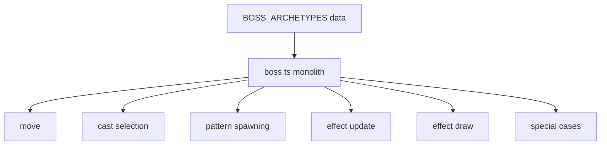

**After**

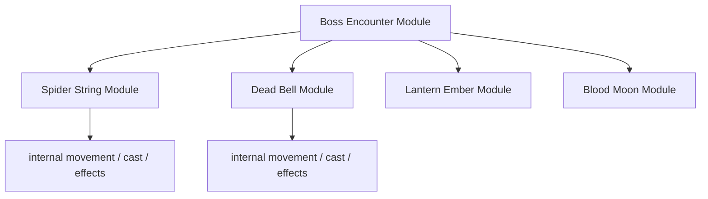

## 候选 5：Separate asset manifest from image loading

**Recommendation strength**：Worth exploring
**Dependency category**：local-substitutable

**Files**

- `src/constants/assets.ts`
- `src/assets.ts`
- `src/types/assets.ts`
- `docs/SPRITES.md`

**Problem**

`src/constants/assets.ts` 同时是内容 manifest 和 mutable runtime storage：每个 sheet 都带 `image: HTMLImageElement | null`。`src/assets.ts` 又手写重复同一套 catalog 去 load image。这样浏览器 runtime state 泄漏进配置，loader interface 几乎和 asset implementation 一样复杂。

**Solution**

拆分 immutable asset manifest 和 runtime image loading Adapter。deep Module 对外提供 resolved sprite assets；测试 Adapter 可以只验证 manifest 完整性、尺寸和文档漂移，不需要浏览器 image state。

**Benefits**

- locality：素材路径、尺寸和运行时 image state 不再混在一起
- leverage：loader、docs check、sprite validation 共享 manifest
- tests：可以不启动浏览器验证素材合同
- two adapters justify seam：browser image Adapter 与 test validation Adapter 都是真实需求

**Before**

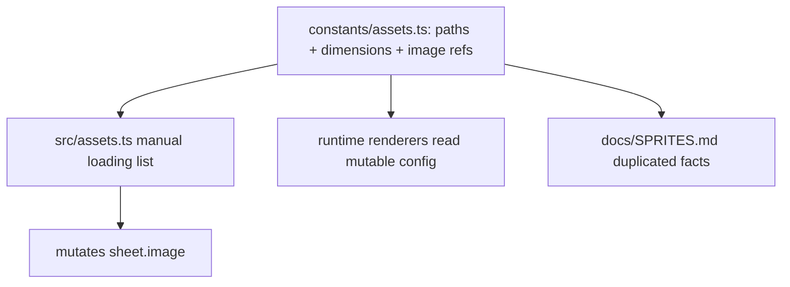

**After**

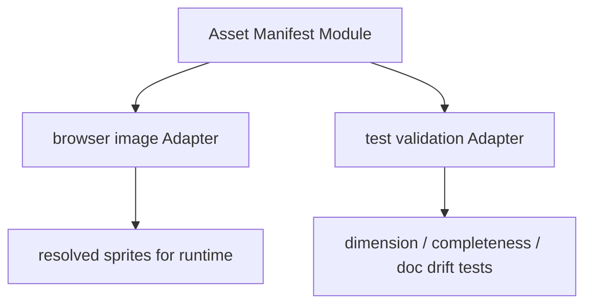

## 候选 6：Keep central state stable, move feature state inward

**Recommendation strength**：Speculative
**Dependency category**：in-process

**Files**

- `src/types/game-state.ts`
- `src/state.ts`
- `src/entities/enemies/*.ts`
- `src/systems/equipment.ts`
- `src/entities/particle.ts`

**Problem**

`GameState`、`PlayerState` 和 `EnemyState` 暴露了太多 feature-specific implementation fields：dash runtime、flow equipment state、每种敌人的 phase/timer 字段、各种 effect arrays、Boss sub-effects。这个 type Module 的 interface 太宽，导致测试 fixture 和新内容都要为无关字段付成本。

**Solution**

不要先动中央状态。等技能、装备、敌人和 Boss Module 变 deep 之后，再把对应 runtime state 移回拥有该行为的 Module implementation 内。中央 state 保留稳定世界事实和跨 Module 需要共享的状态。

**Benefits**

- locality：feature runtime state 跟随 feature behavior
- leverage：测试 fixture 更小
- risk control：放在前 5 个候选之后做，避免只做类型重排

**Before**

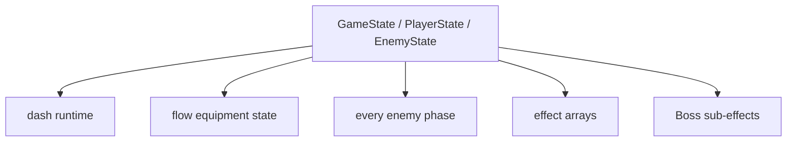

**After**

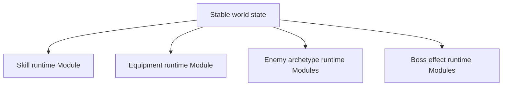

## Top recommendation

先做 **Deepen the player skill catalog**。

原因：它的 leverage 最大且 blast radius 可控。当前“新增或调整一个普通技能”会横跨 content copy、资源元数据、升级候选、技能施放、effect lifecycle、damage/refund、HUD 和测试。把它变成 deep Module 后，后续 9 个普通技能、技能等级、装备 hook 和素材合同都能获得更好的 locality。

第二优先级是 **Deepen combat resolution**。它能把奖励、XP、能量、装备触发和 Boss/敌人击败的重复路径收起来，为死亡原因、伤害归因和更多装备效果留出更稳的 seam。
